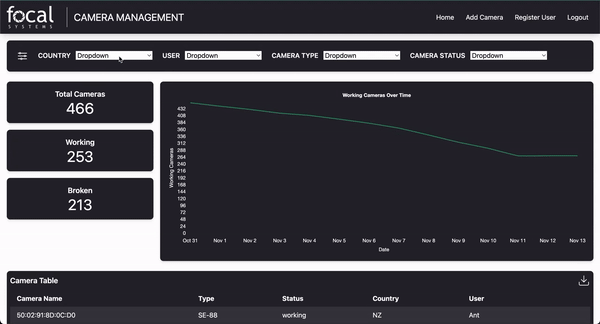
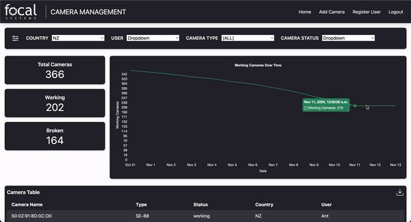

# Goal

The goal of this project was to simplify a process at work where we needed to scan our inventory of cameras and put them into an Excel sheet which we would then need to send to our manager, who would then proceed to combine manually all Excel sheets from different technicians into one document which would then be used to track inventory

Problems
- Camera duplication (scanning so many cameras with similar MAC ids there would sometimes be double-ups)
- No information about the camera (Only the MAC IDs were known, total cameras were known but not what type they were)
- Scans once every 2 months slowed inventory distribution
- Less predictive data collected
- No visibility of current technician stock

Solved
- Duplications handled automatically
- Camera information including type, FOV, status (broken, working) along with scan date
- Scans during shift
- Predictive data collected, including scan time and date, status
- Admin dashboard to view and filter by country, technician

# Preview

### Admin Dashboard

### Excel export

# Setup

### .env file
You will need a .env file with the following
- FLASK_APP = 'wsgi.py'
- FLASK_ENV = 'development' # or production
- SECRET_KEY = '' Generate this
- SQLALCHEMY_DATABASE_URI = "sqlite:///database_name.db"
- SUPABASE_DB_URL = '' # your supabase db

Within config, you can change between SQLite and superbase

### Docker build

**Create the docker image** 
docker build -t image-name .

**Then run it** 
docker run image-name

**Note this was built for work and not generalised** 

If you need an admin account
**python create_admin.py**

username = "admin"
password = "admin"

Note:
I built this project for my workplace, where I didn't want uncontrolled signups

### Using the project

This project was mainly used to track Cameras with Mac_id's and people reporting 'broken' or 'working' cameras however this could be generalised to any item that has a working/not-working state and has an admin Id

